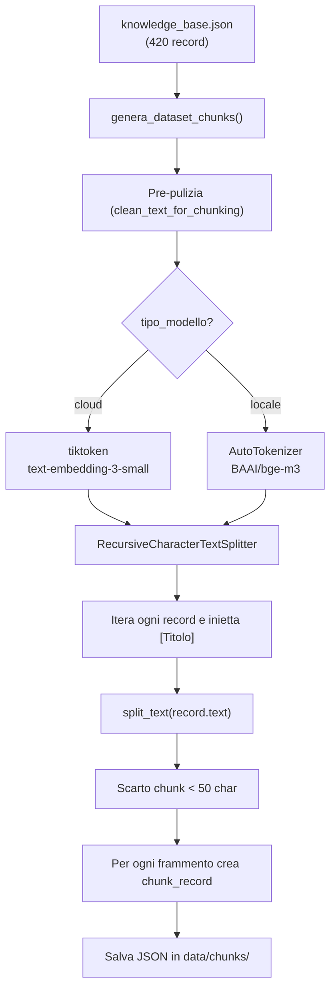

# Analisi dello Script di Chunking e dei File Generati

---

## 1. Come funziona `chunking.py`

### Architettura

Lo script è un generatore di dataset per esperimenti di chunking. Supporta 2 ambienti:

```
knowledge_base.json → [Pulizia & Chunking] → 6 file di chunks (3 cloud + 3 locale)
```

### Flusso di esecuzione



### Dettaglio della funzione `genera_dataset_chunks()`

| Parametro | Scopo |
|---|---|
| `input_file` | Path relativo al JSON sorgente (`data/processed/knowledge_base.json`) |
| `chunk_size` | Target di token per chunk (300, 700, 1000) |
| `chunk_overlap` | Token di overlap (40, 100, 150) |
| `tipo_modello` | `"cloud"` o `"locale"` |
| `nome_modello` | Nome del modello per il tokenizer |

**Pre-pulizia**: Lo script scarta automaticamente testi specchiati (es. `1MOCIDS`, `DLOHX`) e blocchi con predominanza di tag `[Caption]`.
**Iniezione Contesto**: Ogni frammento inizia forzatamente con il titolo del documento per migliorare il retrieval.
**Separatori**: `["\n\n", "\n", ".", " ", ""]` — split gerarchico: prima doppio newline, poi newline, poi punto, poi spazio.
**Generazione chunk_id**: `{document_id}_{section}_{page}_{i}_{tipo_modello}` (Garantisce ID univoci combinando documento, sezione, pagina e indice del frammento).

---

## 2. File generati

I file vengono generati nella cartella `data/chunks/`. Grazie all'inclusione della `section` nel `chunk_id`, **non ci sono più duplicati** e i dati sono pronti per essere inseriti in un vector database (come ChromaDB o FAISS) senza rischio di sovrascritture o perdita di dati durante l'indexing.

I chunk troppo corti (sotto i 50 caratteri) o composti solo da rumore OCR/didascalie vengono scartati automaticamente a monte, ottimizzando lo spazio vettoriale ed evitando di inquinare gli embedding con informazioni non semanticamente rilevanti.

---

## 3. Problemi Rimanenti

Nessun problema bloccante o strutturale rilevato al momento. I difetti principali (ID duplicati, rumore OCR, perdita di contesto nelle tabelle tagliate a metà) sono stati tutti risolti con successo nell'ultima iterazione.

---

## 4. Valutazione Complessiva

### ✅ Punti di Forza dell'attuale implementazione

1. **Gestione ID Robusta**: I chunk_id sono univoci.
2. **Qualità del Dato**: Il rumore OCR e le didascalie inutili sono filtrate. I titoli sono integrati nel testo per fornire contesto immediato all'LLM.
3. **Approccio sperimentale corretto**: Testare 3 dimensioni (300, 700, 1000) × 2 tokenizer è un ottimo design sperimentale.
4. **Tokenizer specifici**: Usare tiktoken per OpenAI e bge-m3 per locale evita i mismatch nel conteggio effettivo dei token.
5. **Path Dinamici**: Lo script è autonomo e portabile nel workspace del progetto (usando percorsi relativi coerenti come `data/chunks`).
6. **Context-Aware Table Chunking**: Le tabelle Markdown vengono preservate in modo intelligente. Anche in presenza di overlap, se un frammento continua una tabella tagliata a metà, l'header delle colonne originale (`| Colonna | Valore |`) viene iniettato automaticamente in cima.
7. **Metadati Arricchiti**: Ogni chunk estratto contiene dati utili come il numero di caratteri (`char_count`), flag di struttura (`has_table`), e rilevamento di codici di allarme (`has_alarm_code`).

### ❌ Limiti Attuali

Attualmente non ci sono limiti bloccanti per proseguire alla fase di caricamento nel Vector DB.

---

## 5. Sviluppi Futuri (Opzionali)

- **Valutazione con LLM come Giudice**: Creare un test set automatizzato (RAGAS / Trulens) per misurare quantitativamente se il retrieval preferisce la versione cloud o locale.
- **Supporto multi-lingua**: Se in futuro ci saranno documenti non inglesi, lo script potrebbe estrarre l'idioma come metadato (es. `language="it"`).

---

## 6. Riepilogo

| Domanda | Risposta |
|---|---|
| Lo script è pronto all'uso? | **Sì**, i file generati sono ora puliti, univoci e direttamente indicizzabili in un Vector DB. |
| Quale chunk size è migliore? | Per gli allarmi o i paragrafi normali, 300 token è ottimale. Per le tabelle strutturate, 700-1000 aiuta a limitare i tagli a metà. |
